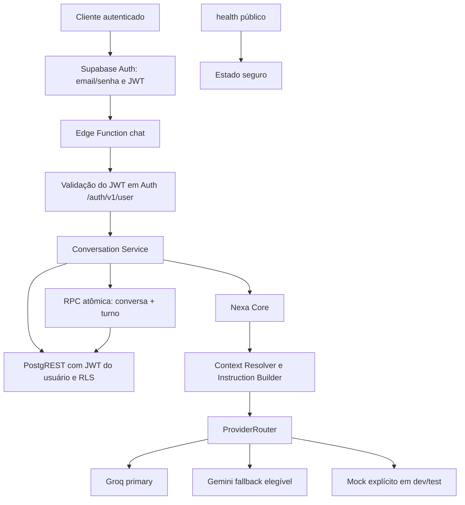

# Arquitetura

A Nexa usa Supabase Auth, Edge Functions e PostgreSQL local para conversas persistentes. A camada de IA continua separada da autenticação e do armazenamento. Ascent e ERP permanecem somente contextos de instrução; não há integração com dados ou permissões desses produtos.

## Fluxo implementado



O cliente chama apenas a API da Nexa. O corpo público não expõe formatos de provider. O `context` informado pelo cliente é dado não confiável, não concede permissões e não muda a identidade obtida pelo JWT.

| Componente | Responsabilidade |
| --- | --- |
| `chat/index.ts` | CORS, método, autenticação, limite de corpo, JSON e envelope HTTP. |
| `conversations/index.ts` | Listar, detalhar e excluir as próprias conversas com paginação. |
| `health/index.ts` | Estado seguro do serviço sem exigir Auth. |
| `_shared/auth/authenticate.ts` | Exigir Bearer JWT e confirmar identidade pelo endpoint de usuário do Supabase Auth. |
| `_shared/conversations/conversation-service.ts` | Validar conversa/app, aplicar quota, carregar histórico curto, chamar o Core e gravar o turno. |
| `_shared/conversations/supabase-store.ts` | Usar JWT/chave pública nas operações sob RLS e a service role somente no commit atômico server-side do turno. |
| `_shared/core/nexa-core.ts` | Resolver contexto e instruções, chamar o provider injetado, normalizar resposta. |
| `_shared/ai/` | Contrato próprio da Nexa, ProviderRouter, Groq, Gemini e Mock. |
| `supabase/migrations/20260913170000_auth_conversations.sql` | Schema, RLS, funções e índices. |

## Auth e autorização

Supabase Auth guarda contas e senhas; a Nexa não cria tabela de senhas nem `profiles` nesta etapa. Login local por email/senha gera um access token. `chat` e `conversations` usam `verify_jwt = true` no gateway e confirmam o token dentro da função por `GET /auth/v1/user`. No contrato de `chat`, o `user_id` vem exclusivamente da identidade validada e não é aceito no corpo. `health` permanece público com `verify_jwt = false`.

Consultas, listagem, exclusão e rate limit usam o JWT do próprio usuário mais a chave pública/anon do stack, preservando RLS. A única exceção é `nexa_append_turn`: a Edge Function usa a service role server-side para gravar a resposta `assistant` junto do turno. Essa RPC não é executável por `authenticated`; recebe o ID já validado pelo Auth e revalida papel server-side, owner e app dentro da transação. A chave privilegiada não é devolvida nem registrada. Falta de token ou token inválido produz 401; indisponibilidade de Auth produz erro seguro. Identificadores de conversa alheia resultam em 404.

Qualquer usuário autenticado **local** pode testar `nexa`, `ascent` e `erp`. A autorização real de acesso a Ascent/ERP ainda não existe e deve ser definida na integração futura dos produtos.

## Schema e RLS

A migration cria somente `public.conversations`, `public.messages` e `public.rate_limit_windows`. A identidade continua em `auth.users`; não há tabela de memória, perfil, dados de produto ou Tools.

| Tabela | Campos e integridade principais | Acesso |
| --- | --- | --- |
| `conversations` | UUID, `user_id` FK para `auth.users`, `app` limitado a `nexa/ascent/erp`, título determinístico de até 80 caracteres, timestamps. `user_id` e `app` são imutáveis. | RLS: usuário autenticado seleciona, insere, altera título e exclui apenas as próprias linhas. |
| `messages` | UUID, FK para conversa com `ON DELETE CASCADE`, role `user/assistant`, conteúdo, metadados opcionais de provider/modelo/request ID e timestamp. Não persiste system prompt nem reasoning. | RLS: usuário lê mensagens de suas conversas e insere somente mensagens `user` nelas. Mensagens `assistant` são gravadas pela RPC do turno. |
| `rate_limit_windows` | Uma janela fixa por usuário e duração, com contador e timestamp. | RLS habilitada, sem grants ou policies de cliente; apenas RPC autenticada consome a quota. |

As funções privilegiadas ficam em `nexa_private`, fora dos schemas expostos pelo PostgREST, com `search_path` vazio. O rate limit usa wrapper invoker concedido a `authenticated` e deriva a identidade de `auth.uid()`. O wrapper de `nexa_append_turn` é server-only, concedido apenas a `service_role`, e a implementação revalida o papel, o `p_user_id`, ownership e app dentro da transação. As policies impedem leitura, alteração, exclusão ou inserção cruzada entre usuários. A exclusão real de uma conversa remove suas mensagens por cascade.

## Chat persistente

`POST /functions/v1/chat` recebe:

```json
{"app":"nexa","message":"Olá","conversation_id":"UUID opcional","context":{}}
```

`app` aceita apenas `nexa`, `ascent` e `erp`. O corpo JSON tem limite de 32.768 bytes; `message` é aparada, obrigatória e limitada a 4.000 caracteres; `context` é objeto JSON opcional de até 16.384 bytes. Campos de topo desconhecidos são rejeitados. `conversation_id`, quando presente, precisa ser UUID. Não há `user_id` no contrato. Um `x-request-id` válido é preservado ou a Nexa gera UUID.

Sem `conversation_id`, o serviço cria uma nova conversa para o usuário autenticado. Com ID, exige conversa própria e mesmo `app`: desconhecida ou alheia retorna 404; app divergente retorna 409. O título usa até os primeiros 80 caracteres da primeira mensagem, sem chamada extra de IA. Depois de validar e aplicar rate limit, o serviço carrega as últimas **8 mensagens**, reduzidas a no máximo **12.000 caracteres** pela remoção das mais antigas, e as entrega como histórico normalizado ao Core. Groq e Gemini traduzem o mesmo histórico para seus formatos próprios. Não há resumo nem memória longa.

O Core chama o ProviderRouter, que executa o primary e, para falha técnica elegível, no máximo um fallback sequencial. **A conversa e as duas mensagens do turno são gravadas juntas pela RPC somente após o provider responder com sucesso.** Se o provider falhar, não fica uma mensagem de usuário órfã nem conversa nova vazia. Uma falha de armazenamento após resposta do provider retorna erro seguro; o turno não é confirmado parcialmente no banco. A tentativa ainda consome quota de rate limit.

Resposta de sucesso:

```json
{
  "ok": true,
  "data": {
    "conversation_id": "UUID",
    "reply": "Resposta da Nexa",
    "app": "nexa",
    "provider": "mock",
    "model": "mock"
  },
  "request_id": "UUID"
}
```

Erros seguem `{"ok":false,"error":{"code":"...","message":"..."},"request_id":"..."}` sem corpo bruto de fornecedor, prompt, token ou stack.

## API de conversas

As Edge Functions abaixo exigem Bearer JWT. O envelope contém `ok`, `data` e `request_id`.

| Método e rota | `data` | Paginação |
| --- | --- | --- |
| `GET /functions/v1/conversations` | `conversations` com `id, app, title, created_at, updated_at` e `pagination`. | `limit` padrão 20, intervalo 1–50; `offset` padrão 0, até 10.000. |
| `GET /functions/v1/conversations/{uuid}` | `conversation`, `messages` e `pagination`. | `limit` padrão 50, intervalo 1–100; `offset` padrão 0, até 10.000. |
| `DELETE /functions/v1/conversations/{uuid}` | `conversation_id` e `deleted: true`. | Exclusão real; mensagens removidas por cascade. |

As listagens não trazem todas as mensagens. Conversa inexistente ou alheia retorna 404. Não há Edge Function separada para criar conversa: o fluxo de chat cria a conversa no primeiro turno. O Data API do Supabase continua expondo operações concedidas por coluna em `conversations` e inserção direta de mensagens `user`, sempre limitadas por RLS e `auth.uid()`; por isso um cliente REST fornece o próprio `user_id`, que a policy confere contra o JWT.

## Limites, CORS e privacidade

`NEXA_RATE_LIMIT_PER_MINUTE` configura a quota por usuário autenticado, com padrão local de **6 tentativas por janela fixa de 60 segundos** (aceita 1–100). A RPC PostgreSQL serializa incrementos concorrentes. Exceder a quota devolve HTTP 429 com `Retry-After`. É uma proteção básica contra spam, não um sistema de billing ou quotas por produto. Limites de corpo, mensagem, validação estrita, JWT e allowlist CORS completam essa proteção.

`NEXA_ALLOWED_ORIGINS` é uma allowlist exata; `*` é rejeitado pela configuração. Chamadas sem `Origin` são aceitas para ferramentas locais. O plugin CORS do gateway Kong local já foi observado acrescentando wildcard/interceptando preflight; o `POST` com origem fora da allowlist foi recusado pela função. Essa política do gateway requer revisão antes de cloud. CORS não substitui Auth ou RLS.

Logs estruturados distinguem os estágios `provider` e `request` e usam apenas request ID, app, conversation ID quando disponível, provider e metadados operacionais seguros. Assim, sucesso do provider seguido de falha no commit não é confundido com sucesso HTTP. Os logs não registram email, mensagem, histórico, `context`, prompt, JWT, chave, corpo bruto de provider ou stack. Chaves locais ficam em `supabase/functions/.env` ignorado; `.env.example` contém somente nomes e valores não secretos.

## Providers e limites da fase

Groq é primary local, com modelo configurável e padrão `openai/gpt-oss-120b`. Gemini é fallback configurado, com modelo padrão `gemini-3.8-flash`. Ambos usam `fetch` nativo, timeout e erros categorizados. Mock é selecionável explicitamente em desenvolvimento/teste para operação offline. Fallback só ocorre para rate limit do fornecedor, timeout, erro de rede, indisponibilidade ou resposta tecnicamente inválida. Erros de autenticação/configuração do provider, recusas de segurança e erros desconhecidos não acionam fallback. Em `development` e `test`, a exceção explícita `PRIMARY_NOT_CONFIGURED` permite usar um fallback configurado quando o primary não tem credencial; em produção, isso encerra a chamada como erro de configuração. O Router nunca consulta os dois simultaneamente.

Quando Groq ou Gemini está ativo, a mensagem e o `context` fornecidos são enviados ao provider selecionado; a política de minimização e redação para dados reais permanece pendente. Sem `Content-Length`, o adaptador ainda carrega o corpo antes de medir 32 KiB, portanto um gateway futuro também deve impor o limite antes da Edge Function. Não há dados reais de Ascent/ERP, Tools, memória longa, embeddings, Consensus, frontend ou cloud/deploy. Permanecem pendentes as permissões específicas dos produtos, CORS do gateway em cloud, observabilidade/custos e operação de produção. Registros de decisão estão em [[05 - Decisoes]]; verificações da implementação ficam em [[06 - Estado atual]].
