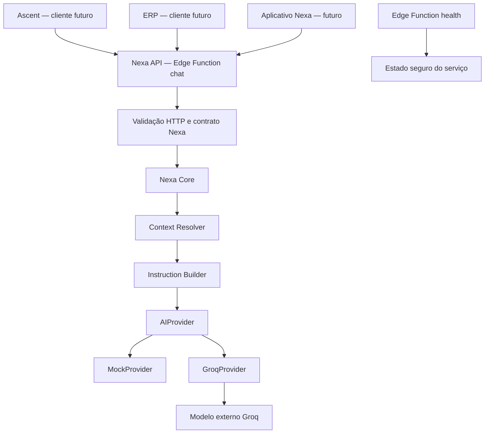

# Arquitetura

Esta é a arquitetura implementada do primeiro incremento técnico da [[00 - Nexa|Nexa]], validada localmente em 12/09/2026. O incremento é deliberadamente stateless e ainda não integra clientes, usuários ou dados reais.

## Fluxo implementado



As setas dos clientes representam a fronteira arquitetural futura. Ascent e ERP ainda não fazem chamadas reais. Os clientes conversam somente com a API Nexa; nenhum contrato público expõe o formato bruto de um fornecedor.

## Componentes

| Componente | Implementação e responsabilidade |
| --- | --- |
| Adaptador HTTP | `supabase/functions/chat/index.ts`: CORS, método, limite de corpo, JSON, configuração, Core e envelope HTTP. |
| Health | `supabase/functions/health/index.ts`: comprova que a camada Nexa está ativa sem depender do provider ou expor ambiente completo. |
| Nexa Core | `_shared/core/nexa-core.ts`: valida a solicitação, resolve o contexto, constrói instruções, obtém o provider injetado, chama-o e normaliza o resultado. Não importa implementações concretas de provider. |
| Context Resolver | `_shared/context/context-resolver.ts`: reconhece somente `nexa`, `ascent` e `erp` e fornece a orientação própria de cada contexto. |
| Instruction Builder | `_shared/instructions/instruction-builder.ts`: combina a identidade base da Nexa com a instrução do contexto e os limites de acesso. O conteúdo do Vault não é injetado. |
| AIProvider | `_shared/ai/provider.ts`: contrato interno definido pela Nexa. |
| MockProvider | Provider determinístico, offline e sem chave, usado por padrão e nos testes. |
| GroqProvider | Adaptador HTTP com `fetch`, timeout, validação da resposta e erros seguros. Não usa SDK. |
| Configuração | `_shared/config/config.ts`: lê ambiente, provider, allowlist CORS e opções Groq em um ponto central. |
| Validação e erros | Tipos, limites, request ID, envelopes e erros seguros ficam em módulos pequenos sob `_shared/`. |

## Contrato de chat

Entrada aceita:

```ts
interface ChatRequest {
  app: "nexa" | "ascent" | "erp";
  message: string;
  conversation_id?: string;
  context?: Record<string, unknown>;
}
```

Regras atuais:

- o corpo HTTP deve ser JSON e ter no máximo 32.768 bytes;
- campos de topo desconhecidos são rejeitados;
- `message` é aparada, obrigatória e limitada a 4.000 caracteres;
- `context`, quando enviado, deve ser objeto JSON e ter no máximo 16.384 bytes;
- `conversation_id`, quando enviado, deve ter de 1 a 128 caracteres; ele é apenas validado e não produz histórico nesta fase;
- um `x-request-id` válido é preservado; na ausência ou invalidade, a Nexa gera UUID.

Sucesso:

```json
{
  "ok": true,
  "data": {
    "reply": "Nexa Mock recebeu sua mensagem no contexto ascent.",
    "app": "ascent",
    "provider": "mock",
    "model": "mock"
  },
  "request_id": "..."
}
```

Erro:

```json
{
  "ok": false,
  "error": {
    "code": "INVALID_APP",
    "message": "O aplicativo informado não é reconhecido pela Nexa."
  },
  "request_id": "..."
}
```

## Identidade e contextos

A frase base “Você é Nexa, a inteligência artificial da NexPoint” pertence ao Instruction Builder. Providers recebem instruções já construídas e não definem a identidade do produto.

- `nexa`: contexto geral interno para testes e futuro aplicativo próprio;
- `ascent`: Coach geral, limitado aos dados enviados na chamada, sem Tools ou conhecimento automático do usuário; inclui limite básico contra diagnóstico médico inventado;
- `erp`: suporte técnico básico, sem alegar acesso a banco, movimentações, logs, telas, permissões, arquivos ou Tools.

O `context` opcional é tratado como dado não confiável e permanece separado das instruções de sistema.

## Providers

O Core depende somente de `AIProvider.generate(request)`. A factory concreta fica no adaptador HTTP, permitindo acrescentar outros providers sem mudar o Core ou os clientes.

O MockProvider retorna texto previsível e modelo `mock`. O GroqProvider usa o endpoint de chat completions da Groq, modelo configurável com padrão `openai/gpt-oss-120b`, timeout configurável com padrão de 30 segundos e `fetch` nativo injetável. Ele trata chave ausente, timeout, rede, HTTP não 2xx, JSON inválido e resposta sem conteúdo. A API nunca devolve corpo bruto, chave ou stack do fornecedor.

## Configuração, CORS e autenticação

Variáveis documentadas em `.env.example`:

```dotenv
NEXA_ENV=development
NEXA_AI_PROVIDER=mock
NEXA_ALLOWED_ORIGINS=http://127.0.0.1:3000,http://localhost:3000
GROQ_API_KEY=
GROQ_MODEL=openai/gpt-oss-120b
GROQ_TIMEOUT_MS=30000
```

O código rejeita `*` na configuração e aplica uma allowlist exata. Chamadas sem `Origin` são aceitas para ferramentas locais. No teste pelo gateway local, o plugin CORS do Kong interceptou `OPTIONS` e acrescentou `Access-Control-Allow-Origin: *` às respostas; uma requisição `POST` com origem fora da allowlist ainda chegou à função e foi rejeitada com HTTP 403. A política do gateway precisa ser revisada antes de qualquer uso cloud.

`health` e `chat` usam `verify_jwt = false` porque Supabase Auth está fora deste incremento e o fluxo local precisava funcionar sem credenciais. Portanto, os endpoints são públicos no ambiente local atual; essa configuração exige revisão junto da autenticação antes de produção.

Os logs estruturados incluem apenas request ID, app validado, provider, duração, sucesso e código de erro. Mensagem, contexto, prompt, tokens, chaves e stack não são registrados.

## Estado e persistência

O fluxo é stateless. Não existem tabelas, migrations, usuários, conversas, mensagens, memória ou Tools. Consulta direta ao PostgreSQL após a implementação confirmou que `public` continua sem relações funcionais da Nexa.

## Cloud e decisões pendentes

Supabase Edge Functions foi escolhido para esta fundação local. Não houve login, link de projeto ou deploy, e a arquitetura de produção continua pendente.

- autenticação, autorização e isolamento por usuário/produto;
- persistência de conversas, histórico e memória;
- contrato de dados e integração real com [[03 - Ascent]] e [[04 - ERP]];
- eventuais Tools controladas e suas permissões;
- política CORS do gateway e segurança para produção;
- política de privacidade/redação antes de enviar dados reais a providers externos;
- rate limit, controle de abuso e limite de payload no gateway;
- operação cloud, observabilidade, custo e estratégia de deploy;
- interface própria, HUD, voz e demais itens visuais futuros.

Mudanças arquiteturais relevantes devem ser registradas em [[05 - Decisoes]]. O estado verificado está em [[06 - Estado atual]].
