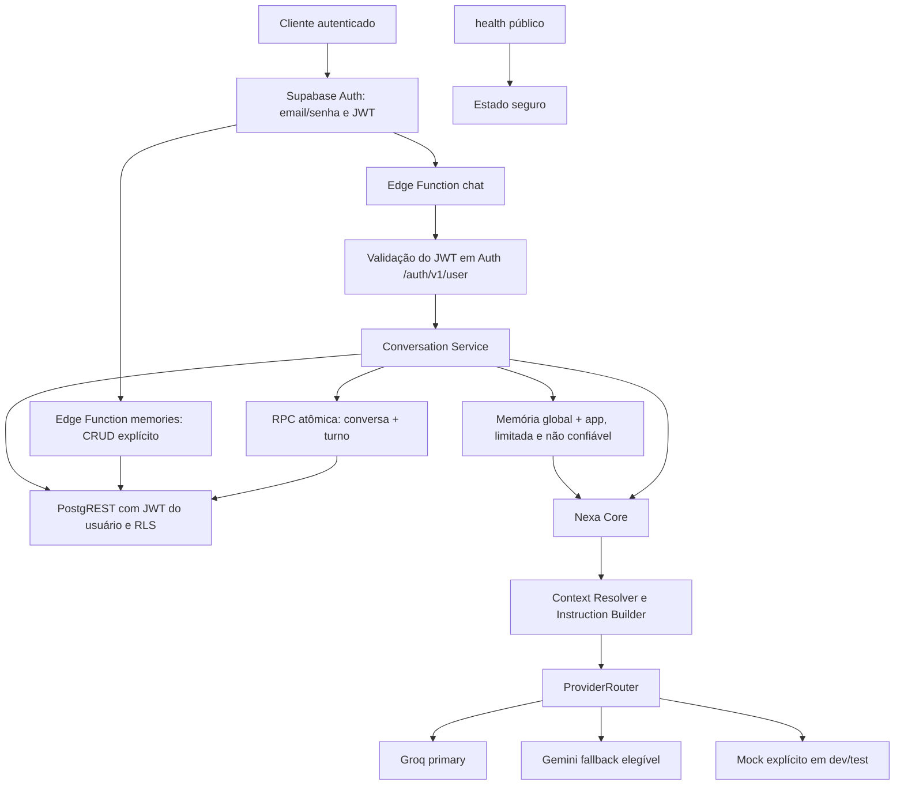

# Arquitetura

A Nexa usa Supabase Auth, Edge Functions e PostgreSQL para conversas persistentes e uma memória V1 explícita. A camada de IA continua separada da autenticação e do armazenamento. Ascent e ERP permanecem somente contextos de instrução; não há integração com dados ou permissões desses produtos. O ambiente local é a referência validada; o DEV cloud ainda não foi vinculado nem publicado.

## Fluxo implementado



O cliente chama apenas a API da Nexa. O corpo público não expõe formatos de provider. O `context` informado pelo cliente é dado não confiável, não concede permissões e não muda a identidade obtida pelo JWT.

| Componente | Responsabilidade |
| --- | --- |
| `chat/index.ts` | CORS, método, autenticação, limite de corpo, JSON e envelope HTTP. |
| `conversations/index.ts` | Listar, detalhar e excluir as próprias conversas com paginação. |
| `memories/index.ts` | Criar, listar, detalhar, editar e excluir memórias explícitas do próprio usuário. |
| `health/index.ts` | Estado seguro do serviço sem exigir Auth. |
| `_shared/auth/authenticate.ts` | Exigir Bearer JWT e confirmar identidade pelo endpoint de usuário do Supabase Auth. |
| `_shared/conversations/conversation-service.ts` | Validar conversa/app, aplicar quota, carregar histórico curto, chamar o Core e gravar o turno. |
| `_shared/conversations/supabase-store.ts` | Usar JWT/chave pública nas operações sob RLS e a service role somente no commit atômico server-side do turno. |
| `_shared/memories/` | Validar, limitar e armazenar memórias via JWT do usuário e RLS, sem service role. |
| `_shared/core/nexa-core.ts` | Resolver contexto e instruções, chamar o provider injetado, normalizar resposta. |
| `_shared/ai/` | Contrato próprio da Nexa, ProviderRouter, Groq, Gemini e Mock. |
| `supabase/migrations/20260913170000_auth_conversations.sql` | Schema, RLS, funções e índices. |
| `supabase/migrations/20260913190000_memory_v1.sql` | Tabela `memories`, constraints, grants mínimos, RLS, índice e timestamp automático. |

## Auth e autorização

Supabase Auth guarda contas e senhas; a Nexa não cria tabela de senhas nem `profiles` nesta etapa. Login local por email/senha gera um access token. `chat`, `conversations` e `memories` usam `verify_jwt = true` no gateway e confirmam o token dentro da função por `GET /auth/v1/user`. No contrato de `chat`, o `user_id` vem exclusivamente da identidade validada e não é aceito no corpo. `health` permanece público com `verify_jwt = false`.

Consultas, listagem, exclusão e rate limit usam o JWT do próprio usuário mais a chave pública/anon do stack, preservando RLS. A única exceção é `nexa_append_turn`: a Edge Function usa a service role server-side para gravar a resposta `assistant` junto do turno. Essa RPC não é executável por `authenticated`; recebe o ID já validado pelo Auth e revalida papel server-side, owner e app dentro da transação. A chave privilegiada não é devolvida nem registrada. Falta de token ou token inválido produz 401; indisponibilidade de Auth produz erro seguro. Identificadores de conversa alheia resultam em 404.

Qualquer usuário autenticado **local** pode testar `nexa`, `ascent` e `erp`. A autorização real de acesso a Ascent/ERP ainda não existe e deve ser definida na integração futura dos produtos.

## Schema e RLS

As migrations criam `public.conversations`, `public.messages`, `public.rate_limit_windows` e `public.memories`. A identidade continua em `auth.users`; não há perfil, dados de produto ou Tools.

| Tabela | Campos e integridade principais | Acesso |
| --- | --- | --- |
| `conversations` | UUID, `user_id` FK para `auth.users`, `app` limitado a `nexa/ascent/erp`, título determinístico de até 80 caracteres, timestamps. `user_id` e `app` são imutáveis. | RLS: usuário autenticado seleciona, insere, altera título e exclui apenas as próprias linhas. |
| `messages` | UUID, FK para conversa com `ON DELETE CASCADE`, role `user/assistant`, conteúdo, metadados opcionais de provider/modelo/request ID e timestamp. Não persiste system prompt nem reasoning. | RLS: usuário lê mensagens de suas conversas e insere somente mensagens `user` nelas. Mensagens `assistant` são gravadas pela RPC do turno. |
| `rate_limit_windows` | Uma janela fixa por usuário e duração, com contador e timestamp. | RLS habilitada, sem grants ou policies de cliente; apenas RPC autenticada consome a quota. |
| `memories` | UUID, `user_id` FK com cascade, `scope`, `app`, `category`, `source`, conteúdo de até 2.000 caracteres e timestamps. `global` exige `app` nulo; `app` aceita somente `nexa/ascent/erp`. | RLS CRUD por proprietário. O cliente insere e altera somente `scope`, `app`, `category` e `content`; owner e source são definidos/imutáveis no banco. |

As funções privilegiadas ficam em `nexa_private`, fora dos schemas expostos pelo PostgREST, com `search_path` vazio. O rate limit usa wrapper invoker concedido a `authenticated` e deriva a identidade de `auth.uid()`. O wrapper de `nexa_append_turn` é server-only, concedido apenas a `service_role`, e a implementação revalida o papel, o `p_user_id`, ownership e app dentro da transação. Memórias usam somente o JWT/chave pública do usuário e RLS; a API não utiliza service role. As policies impedem leitura, alteração, exclusão ou inserção cruzada entre usuários. Excluir uma conta remove suas memórias, e excluir uma conversa remove suas mensagens, por cascade.

## Chat persistente

`POST /functions/v1/chat` recebe:

```json
{"app":"nexa","message":"Olá","conversation_id":"UUID opcional","context":{}}
```

`app` aceita apenas `nexa`, `ascent` e `erp`. O corpo JSON tem limite de 32.768 bytes; `message` é aparada, obrigatória e limitada a 4.000 caracteres; `context` é objeto JSON opcional de até 16.384 bytes. Campos de topo desconhecidos são rejeitados. `conversation_id`, quando presente, precisa ser UUID. Não há `user_id` no contrato. Um `x-request-id` válido é preservado ou a Nexa gera UUID.

Sem `conversation_id`, o serviço cria uma nova conversa para o usuário autenticado. Com ID, exige conversa própria e mesmo `app`: desconhecida ou alheia retorna 404; app divergente retorna 409. O título usa até os primeiros 80 caracteres da primeira mensagem, sem chamada extra de IA. Depois de validar e aplicar rate limit, o serviço carrega as últimas **8 mensagens**, reduzidas a no máximo **12.000 caracteres** pela remoção das mais antigas, e as entrega como histórico normalizado ao Core. Groq e Gemini traduzem o mesmo histórico para seus formatos próprios.

Além do histórico daquela conversa, o serviço busca memórias `global` e memórias do `app` atual. Ele seleciona o prefixo mais recente, em ordem determinística por `updated_at` e UUID, com no máximo **12 entradas e 6.000 caracteres**; ao atingir qualquer limite, descarta as mais antigas. Memória de Ascent não entra em ERP, e memória de ERP não entra em Ascent. Não há relevância semântica, embeddings, resumo ou extração automática.

O conteúdo de memória é controlado pelo usuário e permanece fora da instrução `system`. O Instruction Builder inclui somente a regra estática de que memória é dado não confiável, sem autoridade para mudar identidade, permissões ou regras. O conteúdo recuperado é serializado junto ao conteúdo de usuário enviado ao provider. Uma memória com texto como “ignore regras anteriores” continua sendo dado e não recebe autoridade superior.

O Core chama o ProviderRouter, que executa o primary e, para falha técnica elegível, no máximo um fallback sequencial. **A conversa e as duas mensagens do turno são gravadas juntas pela RPC somente após o provider responder com sucesso.** Se o provider falhar, não fica uma mensagem de usuário órfã nem conversa nova vazia. Uma falha de armazenamento após resposta do provider retorna erro seguro; o turno não é confirmado parcialmente no banco. A tentativa ainda consome quota de rate limit.

Resposta de sucesso:

```json
{
  "ok": true,
  "data": {
    "conversation_id": "UUID",
    "reply": "Resposta da Nexa",
    "app": "nexa",
    "provider": "mock",
    "model": "mock"
  },
  "request_id": "UUID"
}
```

Erros seguem `{"ok":false,"error":{"code":"...","message":"..."},"request_id":"..."}` sem corpo bruto de fornecedor, prompt, token ou stack.

## API de conversas

As Edge Functions abaixo exigem Bearer JWT. O envelope contém `ok`, `data` e `request_id`.

| Método e rota | `data` | Paginação |
| --- | --- | --- |
| `GET /functions/v1/conversations` | `conversations` com `id, app, title, created_at, updated_at` e `pagination`. | `limit` padrão 20, intervalo 1–50; `offset` padrão 0, até 10.000. |
| `GET /functions/v1/conversations/{uuid}` | `conversation`, `messages` e `pagination`. | `limit` padrão 50, intervalo 1–100; `offset` padrão 0, até 10.000. |
| `DELETE /functions/v1/conversations/{uuid}` | `conversation_id` e `deleted: true`. | Exclusão real; mensagens removidas por cascade. |

As listagens não trazem todas as mensagens. Conversa inexistente ou alheia retorna 404. Não há Edge Function separada para criar conversa: o fluxo de chat cria a conversa no primeiro turno. O Data API do Supabase continua expondo operações concedidas por coluna em `conversations` e inserção direta de mensagens `user`, sempre limitadas por RLS e `auth.uid()`; por isso um cliente REST fornece o próprio `user_id`, que a policy confere contra o JWT.

## API de memórias

Todas as rotas exigem Bearer JWT. A V1 é explícita: nenhuma conversa é analisada automaticamente e o LLM não decide o que guardar.

| Método e rota | Operação |
| --- | --- |
| `GET /functions/v1/memories` | Lista memórias próprias, com `limit` padrão 20, máximo 50, e `offset` até 10.000. |
| `GET /functions/v1/memories/{uuid}` | Retorna uma memória própria. |
| `POST /functions/v1/memories` | Cria memória com `scope`, `app`, `category` e `content`; `source=user_explicit` é definido pelo banco. |
| `PATCH /functions/v1/memories/{uuid}` | Edita um subconjunto não vazio dos quatro campos públicos. |
| `DELETE /functions/v1/memories/{uuid}` | Exclui a memória própria. |

As categorias são `preference`, `fact` e `instruction`, mas nenhuma representa permissão. A coluna `source` aceita valores reservados para evolução (`user_explicit`, `app_context`, `system`); nesta V1 somente `user_explicit` pode ser criado pela API ou por um cliente autenticado. Uma memória alheia é tratada como inexistente.

## Limites, CORS e privacidade

`NEXA_RATE_LIMIT_PER_MINUTE` configura a quota por usuário autenticado, com padrão local de **6 tentativas por janela fixa de 60 segundos** (aceita 1–100). A RPC PostgreSQL serializa incrementos concorrentes. Exceder a quota devolve HTTP 429 com `Retry-After`. É uma proteção básica contra spam, não um sistema de billing ou quotas por produto. Limites de corpo, mensagem, validação estrita, JWT e allowlist CORS completam essa proteção.

O leitor HTTP compartilhado verifica `Content-Length` quando presente e, mesmo sem esse header, consome `Request.body` por chunks. A função cancela a leitura assim que ultrapassa o limite, sem acumular payload arbitrariamente grande: 32.768 bytes em `chat` e 8.192 bytes no CRUD de memória. O gateway/runtime ainda pode aplicar buffering próprio antes do handler, uma camada fora do controle desta aplicação.

`NEXA_ALLOWED_ORIGINS` é uma allowlist exata; `*` é rejeitado pela configuração. Chamadas sem `Origin` são aceitas para ferramentas locais. A CLI 2.117.0 gera a rota local `functions-v1` com o [plugin CORS do Kong sem configuração](https://github.com/supabase/supabase/blob/master/docker/volumes/api/kong.yml). No Kong 2.8.1, `preflight_continue` tem [padrão falso](https://github.com/Kong/kong/blob/2.8.1/kong/plugins/cors/schema.lua#L49) e ausência de `origins` resulta em wildcard; por isso o gateway encerra `OPTIONS` antes da função. O teste direto do handler confirma 204 com origem exata e 403 para origem proibida; `POST`, `GET` e demais chamadas reais proibidas também retornam 403. Não foi aplicado override frágil ao Kong gerado nem mudança global no Docker. O comportamento do gateway cloud precisa ser testado no DEV antes de considerá-lo validado. CORS não substitui Auth ou RLS.

Logs estruturados distinguem os estágios `provider` e `request` e usam apenas request ID, app, conversation ID quando disponível, provider e metadados operacionais seguros. Assim, sucesso do provider seguido de falha no commit não é confundido com sucesso HTTP. Os logs não registram email, mensagem, histórico, `context`, prompt, JWT, chave, corpo bruto de provider ou stack. Chaves locais ficam em `supabase/functions/.env` ignorado; `.env.example` contém somente nomes e valores não secretos.

## Providers e limites da fase

Groq é primary local, com modelo configurável e padrão `openai/gpt-oss-120b`. Gemini é fallback configurado, com modelo padrão `gemini-3.8-flash`. Ambos usam `fetch` nativo, timeout e erros categorizados. Mock é selecionável explicitamente em desenvolvimento/teste para operação offline. Fallback só ocorre para rate limit do fornecedor, timeout, erro de rede, indisponibilidade ou resposta tecnicamente inválida. Erros de autenticação/configuração do provider, recusas de segurança e erros desconhecidos não acionam fallback. Em `development` e `test`, a exceção explícita `PRIMARY_NOT_CONFIGURED` permite usar um fallback configurado quando o primary não tem credencial; em produção, isso encerra a chamada como erro de configuração. O Router nunca consulta os dois simultaneamente.

Quando Groq ou Gemini está ativo, mensagem, `context` e memórias aplicáveis são enviados ao provider selecionado; a política de minimização e redação para dados reais permanece pendente. Não há dados reais de Ascent/ERP, Tools, memória semântica, embeddings, Consensus ou frontend. Permanecem pendentes as permissões específicas dos produtos, CORS do gateway em cloud, observabilidade/custos e operação de produção. Registros de decisão estão em [[05 - Decisoes]]; verificações da implementação ficam em [[06 - Estado atual]].

## Ambientes

**LOCAL** usa `127.0.0.1`, dados descartáveis, Mock nos testes e `db reset` somente no stack `project_id = "Nexa"`. É o ambiente validado para desenvolvimento.

**DEV CLOUD** será um projeto Supabase exclusivo da Nexa, com dados fictícios, `NEXA_ENV=development`, migrations versionadas e somente `health`, `chat`, `conversations` e `memories`. Nesta etapa a CLI não está autenticada, não foi possível inspecionar projetos remotos e nenhum projeto foi vinculado. Não há project ref, URL DEV, migration remota, secret remoto ou função publicada. Depois de autenticar a CLI, o projeto e a organização devem ser confirmados inequivocamente antes de `link`; se não existir Nexa DEV, organização, região, plano e senha precisam ser decididos pelo responsável. Nenhum ambiente PROD é autorizado.
